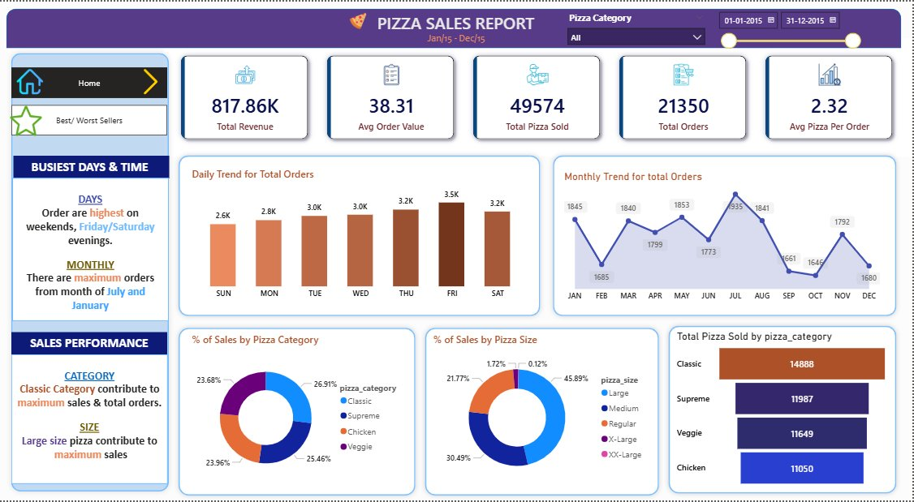
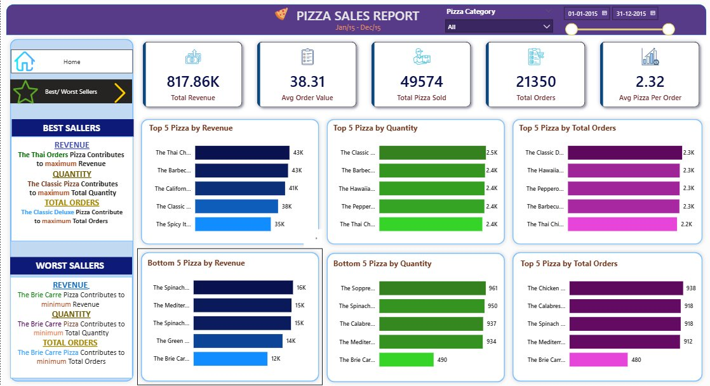

# 🍕 Pizza Sales Data Analysis Dashboard


---

## 📋 Project Overview

An end-to-end data analysis solution for a pizza restaurant's sales performance covering **January 2015 to December 2015**. By leveraging **SQL** for robust data processing and **Power BI** for interactive visualization, this dashboard enables business stakeholders to monitor sales trends, identify top-performing menu items, and optimize operational strategies.

---

## 🖼 Dashboard Snapshots

### Page 1 — Home Dashboard

> KPI metrics, daily & monthly order trends, sales by category and size.

### Page 2 — Best & Worst Sellers

> Top 5 and Bottom 5 pizzas ranked by Revenue, Quantity, and Total Orders.

---

## 📊 Key Metrics

| Metric | Value |
|---|---|
| 💰 Total Revenue | $817.86K |
| 🧾 Average Order Value | $38.31 |
| 🍕 Total Pizzas Sold | 49,574 |
| 📦 Total Orders | 21,350 |
| 🔢 Avg Pizzas Per Order | 2.32 |

---

## 🛠 Technical Stack

- **Database:** MS SQL Server — data extraction, KPI calculation, and validation
- **Visualization:** Power BI — data modeling, Power Query transformations, DAX measures, and dashboard design
- **Methodology:** Two-way validation process ensuring Power BI visuals align precisely with SQL query results

---

## 📈 Key Features & Analysis

### 🔢 KPI Summary
High-level metrics tracking Total Revenue, Average Order Value, Total Pizzas Sold, Total Orders, and Average Pizzas per Order.

### 📅 Interactive Trends
- **Daily Trend:** Friday and Saturday evenings see the highest order volumes
- **Monthly Trend:** July and January record the maximum number of orders

### 🍕 Sales Performance
- **By Category:** Classic pizzas contribute the most to total sales and orders
- **By Size:** Large size pizzas generate maximum revenue

### 🏆 Best & Worst Sellers
- **Best Revenue:** The Thai Chicken Pizza (43K)
- **Best Quantity:** The Classic Deluxe Pizza (2.5K)
- **Worst Revenue:** The Brie Carre Pizza (12K)

---

## 🚀 Navigation & Interactivity

- **Dynamic Filtering:** Integrated slicers for pizza categories and date ranges for granular data exploration
- **Page Navigation:** Seamless toggle between Home and Best/Worst Sellers views using custom navigator buttons
- **Cross-filtering:** All visuals are interconnected — clicking one updates the rest

---

## 📁 Project Structure

```
Pizza-Seles/
│
├── Pizza_Sales_Queries.sql       # SQL scripts for data analysis & validation
├── Pizza_Sales_Dashboard.pbix    # Power BI source file
├── dashboard_home.png            # Screenshot - Home page
├── dashboard_sellers.png         # Screenshot - Best/Worst Sellers page
└── README.md                     # Project documentation
```

---

## 💡 Key Business Insights

1. **Peak Days:** Orders are highest on **Fridays and Saturdays** — ideal for targeted promotions
2. **Peak Months:** **July and January** drive maximum orders — plan inventory accordingly
3. **Top Category:** **Classic pizzas** dominate both sales and orders
4. **Top Size:** **Large pizzas** are the most preferred size by customers
5. **Underperformers:** **Brie Carre Pizza** consistently ranks last — consider menu revision

---

## 👨‍💻 Author

**Valand Jay**
- 📧 jay4486@gmail.com
- 🐙 [GitHub](https://github.com/jayy4486-cell)

---

⭐ If you found this project useful, please consider giving it a star!
